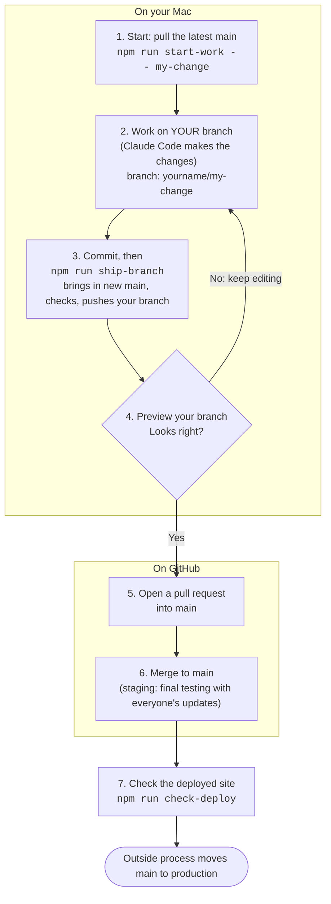

# Team workflow: from an idea to `main`

Everyone works the same way. `main` is our **staging area**: it is where updates from the whole
team come together for final testing. Moving from `main` to production is done by a separate,
outside method and is not covered here.

## The flow



Plain-text version of the same flow:

```
 latest main ──> your branch ──> commit ──> push branch ──> preview ──> pull request ──> main (staging) ──> production (outside process)
   (step 1)        (step 2)      (step 3)    (step 3)       (step 4)     (step 5)         (steps 6 and 7)
```

## Step by step

### 1. Start from the latest `main`
```bash
cd /Users/bmccarty/invoca-demo-platform-testing
npm run start-work -- my-change
```
This switches to `main`, pulls everything the team has committed, and creates the branch
`<your-git-name>/my-change` from it. It stops if you have uncommitted changes, so nothing is carried
onto the wrong branch. Use lowercase letters, numbers and dashes for the name.

### 2. Make the changes with Claude Code
Work only on your branch. Run the app to try it:
```bash
npm run serve        # builds and starts the real server at http://localhost:3000
```
(`npm run dev` at port 5173 is the internal app only. The customer pages at `/d/<slug>` need
`npm run serve`.) Email does not send from your Mac; callbacks still land in the Inbox.

### 3. Commit, then push your branch
```bash
git add -A && git commit -m "Say what changed and why"
npm run ship-branch
```
`ship-branch` first merges the newest `main` into your branch (so you never preview stale code),
runs the type check, and pushes your branch. If the merge reports conflicts, resolve the files it
lists (Claude Code can do this), commit, and run it again.

### 4. Preview your branch
- **On your Mac:** `npm run serve`, then open `http://localhost:3000`.
- **A link to share:** Render can build a preview for each branch or pull request. It is a Render
  setting (see "What needs Render" below). Once on, the link appears on your pull request.

### 5. Open a pull request into `main`
`ship-branch` prints the link. Check that **base** is `main` and **compare** is your branch.
Ask a teammate to look when it matters.

### 6. Merge to `main`, then check it
After merging, the staging site rebuilds from `main` (a few minutes):
```bash
git checkout main && git pull origin main
npm run check-deploy
```
Staging site: https://invoca-demo-platform-testing.onrender.com . `check-deploy` compares the
commit it is running with yours. You can also open `/api/status` on that site and read `commitShort`.

### 7. Production
Moving `main` to production is handled outside this process.

## Rules that keep `main` healthy
- **Never work directly on `main`.** Branch first, every time.
- **One purpose per branch.** Small branches merge cleanly and are easy to review.
- **Pull `main` before you start and again before you push** (the scripts do both).
- **Do not commit test demos.** Creating a demo on your Mac can write a file into
  `src/data/generated/`. Those files are bundled for everyone. Leave your test ones untracked
  (`git status` shows them under "Untracked"), and never `git add -A` without looking at the list.
- **Run the checks that match what you touched** (`npm run typecheck` always; `npm run audit:share`,
  `audit:customer`, `audit:support` for the customer demo feature; `npm run audit` for everything).
- **No secrets in commits.** Keys live in `.env` (git-ignored) and in Render's environment settings.
- **Where conflicts usually happen:** the `audit` line in `package.json`, the plugin list in
  `vite.config.ts`, and the end of `src/styles/app.css`. These are lists that several people add to.
  Keep both sides.

## One-time setup on your Mac
- Git needs a name and email: `git config --global user.name "Your Name"` and
  `git config --global user.email "you@invoca.com"`.
- GitHub needs a login git can use. Run `git push` once; when asked, enter your username and a
  **personal access token** (classic, `repo` scope) as the password. macOS Keychain remembers it.
- You need **Write** access to `ddesai-invoca/invoca-demo-platform-testing` (a collaborator invite).

## What needs Render
These need someone with access to the Render service, and are not done by this workflow:
- **A link per branch or pull request:** turn on pull request previews in the service's settings
  (not every plan has them), and give previews the same environment variables as staging.
- **A separate staging service:** if the staging site above should stay separate from production,
  it must be its own Render service watching its own branch. See `docs/ENVIRONMENTS.md`.

## Commands at a glance
| Command | What it does |
|---|---|
| `npm run start-work -- <name>` | Pull latest `main`, create your branch |
| `npm run serve` | Build and run the full app at `http://localhost:3000` |
| `npm run ship-branch` | Merge latest `main` into your branch, check, push it |
| `npm run check-deploy` | Is the staging site running my latest commit? |
